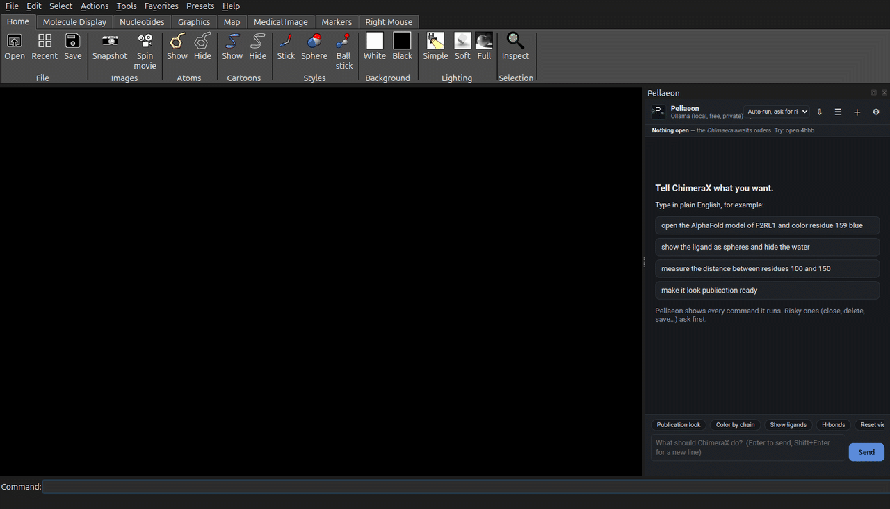
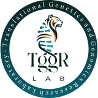

# Pellaeon

**Talk to UCSF ChimeraX in plain English.** A chat panel inside ChimeraX that turns what you type into ChimeraX commands, shows you every command it ran, and asks before anything destructive.

<br clear="left">



## Install

Pellaeon is on the [ChimeraX Toolshed](https://cxtoolshed.rbvi.ucsf.edu/apps/chimeraxpellaeon). In ChimeraX, open **Tools > More Tools...** and press **Install** next to Pellaeon, or paste this into the command line (bottom of the window):

```
toolshed install ChimeraX-Pellaeon
```

Open it from **Tools > General > Pellaeon**. Pick a model provider, paste a key if it needs one, press **Test connection**, then **Save & use**. Needs ChimeraX 1.9 or newer. `toolshed update ChimeraX-Pellaeon` gets later versions.

Newest release before it reaches the Toolshed: paste `open https://github.com/tggr-lab/pellaeon/releases/latest/download/install_pellaeon.py` into the same command line; it installs that release and opens the panel.

Offline: download the `.whl` from [Releases](https://github.com/tggr-lab/pellaeon/releases) and run `toolshed install /path/to/the/file.whl`.

## Models

- **Free, no card:** Mistral's free tier (recommended, fast) or Google Gemini.
- **Local, private:** Ollama on your own computer (`gemma4:12b` on a 12 GB GPU, `qwen3:8b` on 8 GB).
- **Paid:** Anthropic Claude, OpenAI, Mistral Medium, or any OpenAI-compatible server (OpenRouter, Groq, LM Studio).

Keys stay on your computer. How to get a key, and how each model did on our test set: [tested models](https://tggr-lab.github.io/pellaeon/models.html).

## What you can do

> open the AlphaFold model of ADRB2 and color residue 113 blue
> what is near the selected residue?
> compare this with 4ake and show me which contacts are lost
> color it by ClinVar variants, then by conservation
> tidy the labels and save a figure with its commands

- **Explore a structure:** select, inspect neighbours, measure, label. "it" and "the selected" refer to what is open.
- **Compare conformations:** superpose, residue displacements, lost and gained contacts drawn on the structure.
- **Map your data:** a residue table, UniProt features, ClinVar variants, ConSurf conservation or AlphaMissense scores, placed in the structure's own numbering with a color key.
- **Make figures:** publication look, tidy overlapping labels, save the image with a replayable `.cxc` script and the sources of everything shown.

Every reply lists the commands it ran with copy, re-run and a link to the ChimeraX docs. Closing, deleting, saving and scripts wait for your OK. "Undo last request" restores the session to how it was before the previous request.

Membrane proteins get OPM's orientation on request, receptors their GPCRdb structures and inactive/active AlphaFold models, and ConSurf coloring uses ConSurf's nine grades.

## Learn more

- [Website](https://tggr-lab.github.io/pellaeon/) and [illustrated tutorial](https://tggr-lab.github.io/pellaeon/tutorial.html)
- [Install guide](https://tggr-lab.github.io/pellaeon/install.html) (providers, privacy, where things are stored)
- [Pellaeon and ChimeraX's mcp command](https://tggr-lab.github.io/pellaeon/mcp.html): how they differ, and the `pellaeon tool ...` commands that work from either
- [Classic edition](classic/README.md) for UCSF Chimera 1.x

## Development

```
git clone https://github.com/tggr-lab/pellaeon
cd pellaeon
python -m pytest                                              # unit tests, no ChimeraX needed
chimerax --nogui --exit --cmd "devel install \"$(pwd)\""      # install into your ChimeraX
chimerax --nogui --exit --script tests_chimerax/smoke.py      # in-ChimeraX checks
```

Pure Python, no extra packages. The website is built from `docs/*.md` with `python tools/build_site.py`; `RELEASING.md` covers the wheel. MIT license.

---
<a href="https://github.com/tggr-lab"></a>

Made by [Yam Amir](https://github.com/YAMIR-1138) at the [TGGR Lab](https://github.com/tggr-lab). Named after Gilad Pellaeon, captain of the *Chimaera*. Not affiliated with UCSF.
