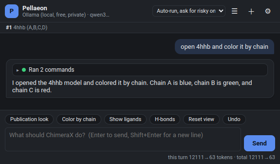

# Pellaeon — talk to ChimeraX in plain English

Pellaeon adds a chat panel to [UCSF ChimeraX](https://www.cgl.ucsf.edu/chimerax/). You type what you want:

> open the AlphaFold model of F2RL1 and color residue 159 blue
> make it look publication ready
> measure the distance between residues 100 and 150

…and Pellaeon runs the ChimeraX commands for you, shows every command it ran (copy or re-run any of them), fixes its own mistakes when a command fails, and asks before doing anything risky (closing models, deleting atoms, saving files).

It works with **local models** (Ollama — free, private, runs on your own machine) and **cloud models** (Anthropic Claude, Google Gemini, OpenAI, and anything OpenAI-compatible such as OpenRouter, Groq or LM Studio). Gemini and OpenRouter have free tiers.

Named after Gilad Pellaeon, captain of the *Chimaera*.



## Install (3 steps)

1. Install ChimeraX 1.9 or newer.
2. In ChimeraX's command line (bottom of the window) type:

   ```
   open https://github.com/pellaeon-chimerax/pellaeon/releases/latest/download/install_pellaeon.py
   ```

   This downloads the Pellaeon bundle and installs it with ChimeraX's own tool installer. No terminal, no Python setup.
3. The Pellaeon panel opens (later: **Tools > General > Pellaeon**). Pick an AI provider, paste a key if it needs one, press **Test connection**, then **Save & use**.

Prefer a file? Download the `.whl` from the [releases page](https://github.com/pellaeon-chimerax/pellaeon/releases) and run `toolshed install /path/to/the/file.whl` in ChimeraX.

## Choosing an AI

| Option | Cost | Notes |
|---|---|---|
| **Ollama** (local) | free | Install [Ollama](https://ollama.com), then in Pellaeon's settings press **Pull** for `qwen3:8b` (needs ~6 GB GPU memory) or `qwen3:4b` / `gemma4:e4b` (runs on almost any PC, slowly on CPU). Nothing leaves your computer. |
| **Google Gemini** | free tier | Get a key at [aistudio.google.com](https://aistudio.google.com/apikey), no credit card. |
| **Anthropic Claude** | pay per use | Best at multi-step work. Key from [console.anthropic.com](https://console.anthropic.com/settings/keys). Claude Pro/Max subscriptions cannot be used by third-party tools. |
| **OpenAI** | pay per use | Key from platform.openai.com. |
| **OpenRouter / Groq** | free tiers | One key, many models; `openrouter/free` picks a free model that supports tools. |
| **LM Studio, llama.cpp, vLLM** | free | Any local OpenAI-compatible server. |

Keys are stored privately on your computer (system keyring or a private file), never in ChimeraX sessions or files you share. Environment variables (`ANTHROPIC_API_KEY`, `GOOGLE_API_KEY`, `OPENAI_API_KEY`) are picked up automatically.

## Using it

- Type a request and press Enter. Pellaeon may look things up first (UniProt for gene names, the ChimeraX docs for syntax), then runs commands. Each assistant reply shows a collapsible **Ran N commands** block; a red dot means that command failed and the error is shown.
- "it", "this", "them", "the selected" work: Pellaeon looks at what is open and selected in ChimeraX.
- Risky commands show a card with the exact commands, editable, with **Run** / **Skip**. The dropdown at the top switches between *ask before every command*, *auto-run but ask for risky ones* (default) and *never ask*.
- Press **Stop** (or Esc) to interrupt. **+** starts a new chat; **☰** lists past conversations.
- The `pellaeon` command works from ChimeraX's own command line and in scripts: `pellaeon color everything by chain`.
- Advanced: allow Python code (always asks first), let vision models look at a screenshot of the view, Claude effort level, temperature.

Try it with a fresh session: `open 4hhb`, then "color by chain", "show the ligand as spheres and hide water", "make it spin", "stop", "label residues 10 and 20", "close everything" (asks first).

## How it works

Pellaeon is a normal ChimeraX bundle (pure Python, no extra packages). It runs inside ChimeraX, so it can execute commands directly, read the log output and errors, and inspect the open models and selection. Documentation for the exact ChimeraX version you run is indexed on first launch from the docs that ship with ChimeraX, so the assistant always sees current syntax. Requests are answered by the model you choose through a small tool-calling loop: the model can run commands, check the session state, look up command syntax, search the docs, resolve proteins via UniProt, fetch UniProt annotations, or ask you a question.

## Development

```
git clone https://github.com/pellaeon-chimerax/pellaeon
cd pellaeon
python -m pytest                        # unit tests, no ChimeraX needed
chimerax --nogui --exit --cmd "devel install \"$(pwd)\""   # install into your ChimeraX
chimerax --nogui --exit --script tests_chimerax/smoke.py    # in-ChimeraX checks
```

See `RELEASING.md` for building the wheel and [docs/tutorial.md](docs/tutorial.md) for the illustrated install-and-use guide. Licensed under MIT.
