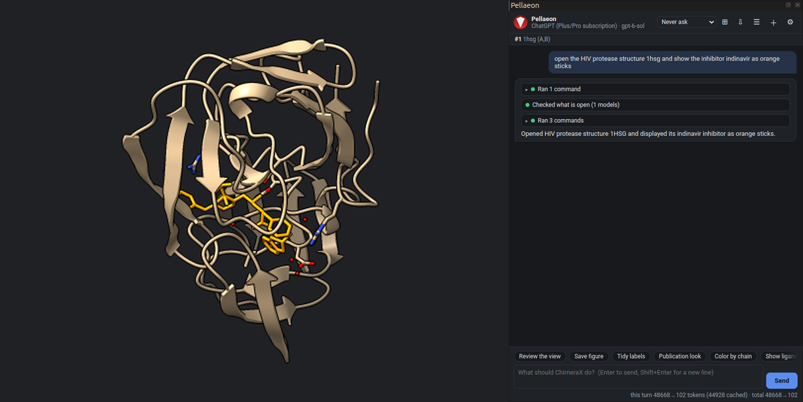
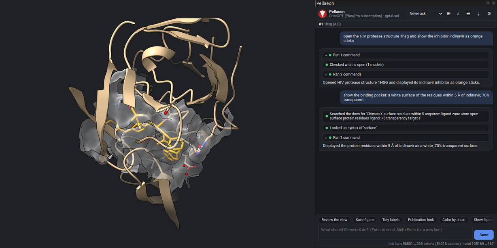
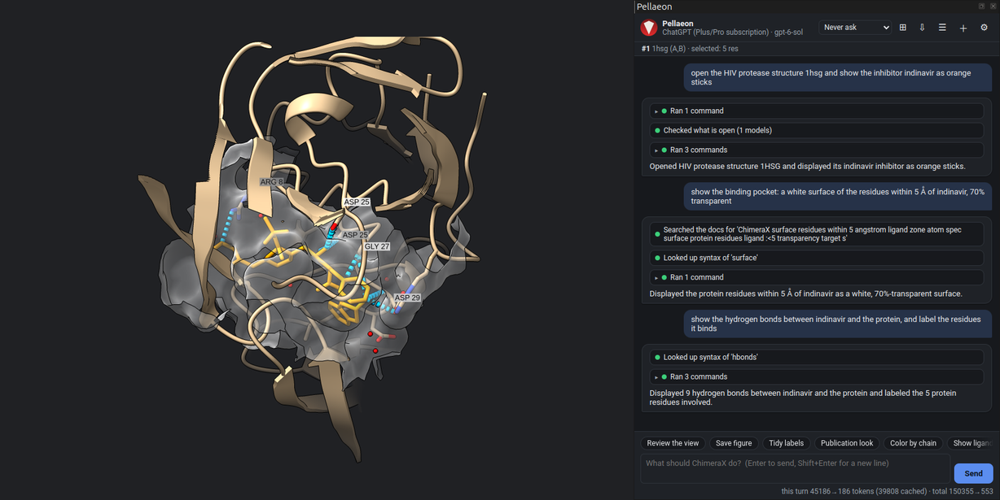
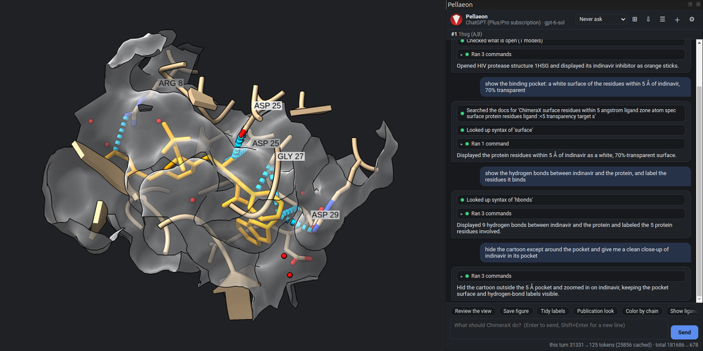
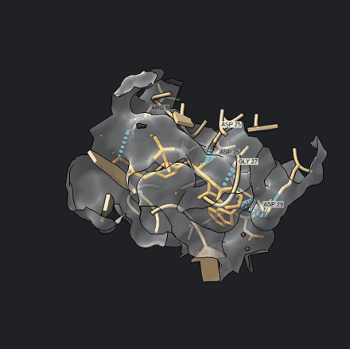

# A ligand in its pocket

HIV-1 protease with the inhibitor indinavir (PDB 1HSG), in four requests.

### 1. Open the structure

> open the HIV protease structure 1hsg and show the inhibitor indinavir as orange sticks

```
open 1hsg
show #1:MK1 atoms; style #1:MK1 stick; color #1:MK1 orange
```

MK1 is the residue name of indinavir in this entry.



### 2. The pocket as a surface

> show the binding pocket: a white surface of the residues within 5 Å of indinavir, 70% transparent

```
surface (#1:MK1 :<5) & protein color white transparency 70
```

`:<5` selects the residues with any atom within 5 Å of the ligand.



### 3. Hydrogen bonds

> show the hydrogen bonds between indinavir and the protein, and label the residues it binds

```
hbonds #1:MK1 restrict protein reveal true select true
select sel & protein; label sel
```

Nine hydrogen bonds to five residues: Arg 8, Asp 25 of both chains, Gly 27 and Asp 29. The catalytic aspartates (Asp 25) bind the inhibitor's central hydroxyl.



### 4. A close-up

> hide the cartoon except around the pocket and give me a clean close-up of indinavir in its pocket

```
hide #1 target c
cartoon (#1:MK1 :<5) & protein
view #1:MK1
```





**Save figure** writes the image, the session and the commands to a folder ([tutorial, step 5b](tutorial.md#step-5b-save-a-figure-you-can-reproduce)).
