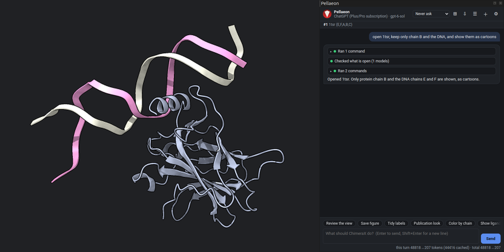
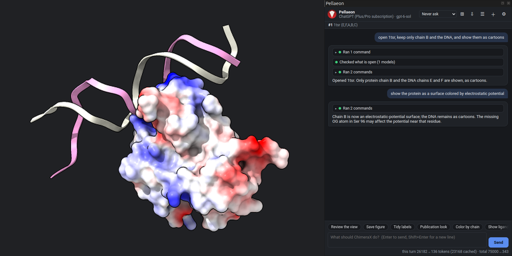
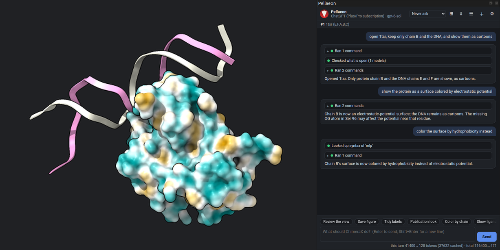
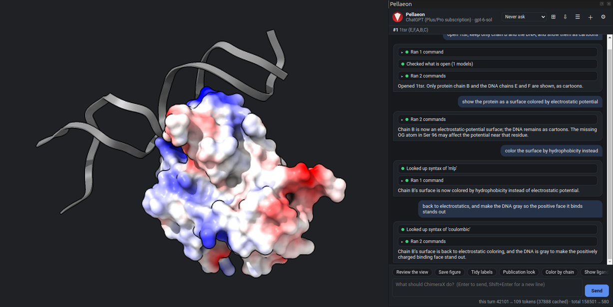
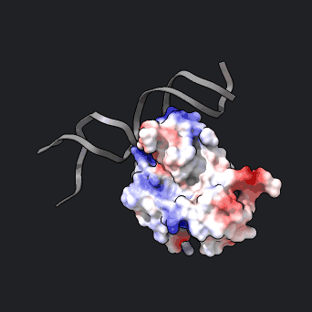

# Electrostatics and hydrophobicity

The p53 core domain bound to DNA (PDB 1TSR), in four requests.

### 1. Open the structure

> open 1tsr, keep only chain B and the DNA, and show them as cartoons

```
open 1tsr
hide #1 target acs; cartoon #1/B,E,F
```

The entry has three copies of the domain (chains A, B, C); chain B is the one on the DNA (chains E and F).



### 2. Electrostatic potential

> show the protein as a surface colored by electrostatic potential

```
cartoon hide #1/B
coulombic #1/B
```

Red is negative, white neutral, blue positive. ChimeraX warns that Ser 96 lacks an atom, so the potential near it is approximate.



### 3. Hydrophobicity

> color the surface by hydrophobicity instead

```
mlp #1/B surfaces #1.3
```

Molecular lipophilic potential on the same surface: hydrophobic patches orange, polar ones teal.



### 4. Which face binds the DNA

> back to electrostatics, and make the DNA gray so the positive face it binds stands out

```
coulombic #1/B surfaces #1.3
color #1/E,F gray
```

The positively charged face of the domain lies against the phosphate backbone.




