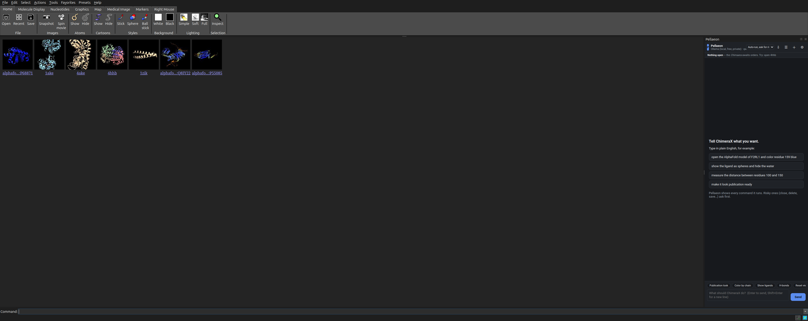
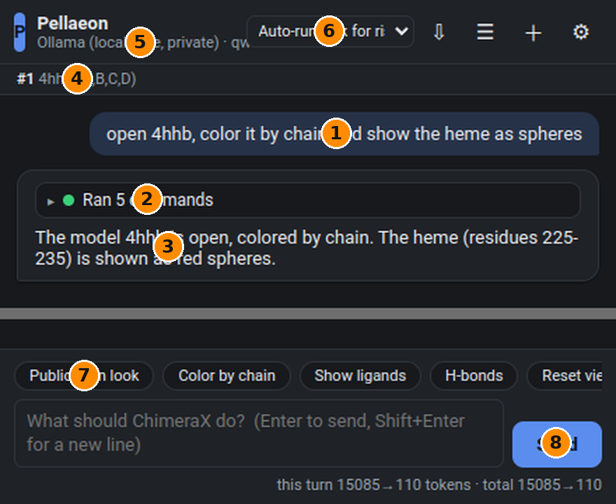
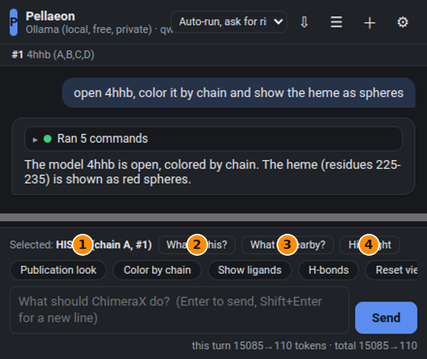
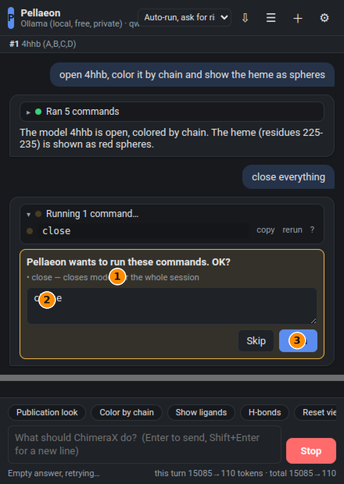
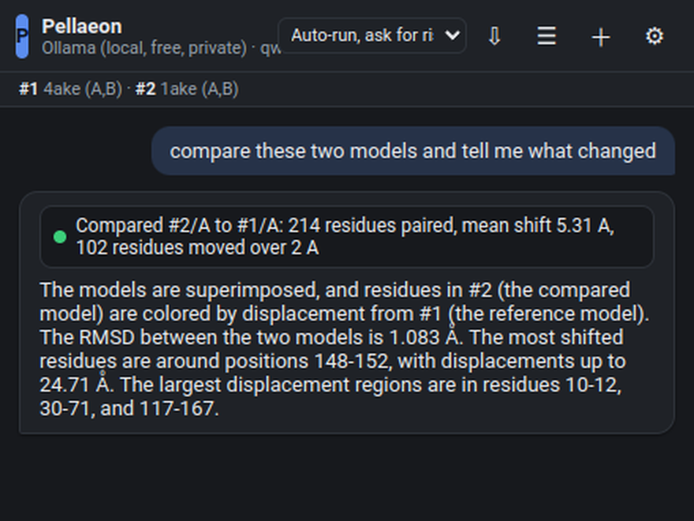
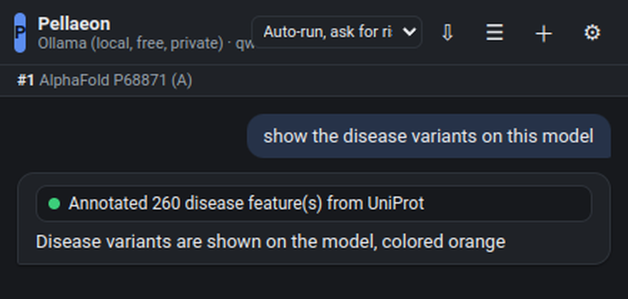

# Pellaeon tutorial: install it, then talk to ChimeraX

Pellaeon is a panel inside UCSF ChimeraX. You type what you want in plain English, it runs the ChimeraX commands, shows you exactly what it ran, and asks before doing anything risky. This guide takes about ten minutes.

## Part 1 — Install (Windows, macOS, Linux)

### What you need

- **ChimeraX 1.9 or newer.** Download from [cgl.ucsf.edu/chimerax/download.html](https://www.cgl.ucsf.edu/chimerax/download.html) and install it like any other program. On Windows, run the `.exe` installer and accept the defaults.
- **An AI to talk to.** Pick one:
  - *Free and private, on your own PC:* [Ollama](https://ollama.com/download). Install it (Windows: run `OllamaSetup.exe`; it starts automatically in the background). You need roughly 6 GB of free GPU memory for the recommended model, or any PC with 8 GB RAM for the small models (slower).
  - *Free in the cloud:* a Google AI Studio key from [aistudio.google.com/apikey](https://aistudio.google.com/apikey). No credit card.
  - *Paid, best quality:* an Anthropic key from [console.anthropic.com](https://console.anthropic.com/settings/keys) or an OpenAI key.

### Step 1 — Install Pellaeon inside ChimeraX

Start ChimeraX. At the bottom of the window is the **Command:** line. Click into it, paste the line below and press Enter:

```
open https://github.com/pellaeon-chimerax/pellaeon/releases/latest/download/install_pellaeon.py
```

ChimeraX downloads Pellaeon and installs it with its own tool installer. The Log shows "Pellaeon ... installed" and the panel opens on the right. That's it. No terminal, no Python, no admin rights.

**No internet on that computer, or the line above fails?** Download the `.whl` file from the [releases page](https://github.com/pellaeon-chimerax/pellaeon/releases) and type this instead (adjust the path; quotes are needed when the path has spaces):

```
toolshed install "C:\Users\you\Downloads\chimerax_pellaeon-0.1.0-py3-none-any.whl"
```

From then on the panel is under **Tools ▸ General ▸ Pellaeon**, and the command `pellaeon` works on the ChimeraX command line.



### Step 2 — Choose your AI (first run)

The first time, Pellaeon opens its settings page.


1. **Pick a provider card.** Ollama for local and free, Gemini for free cloud, Claude or OpenAI for paid. Cloud cards show an **API key** field: paste the key there; it is stored privately on your computer, never inside ChimeraX sessions or files you share.
2. **Model.** A sensible default is filled in; the pills below are good alternatives.
3. **Pull** (Ollama only). Press it once to download the model (about 5 GB); the bar shows progress. Small PCs: pull `qwen3:4b` instead.
4. **Test connection.** You should see "Connected" or "Ollama is running".
5. **Save & use.**

Windows note: keys are stored in a private file under your user profile (`%LOCALAPPDATA%\UCSF\ChimeraX\Pellaeon\`). If you prefer environment variables, set `ANTHROPIC_API_KEY`, `GOOGLE_API_KEY` or `OPENAI_API_KEY` and leave the key field empty.

## Part 2 — Using it

### Your first request

Type into the box at the bottom and press Enter:

> open 4hhb, color it by chain and show the heme as spheres



1. **Your request.**
2. **Ran N commands.** Click to expand: every command Pellaeon executed, one line each. A green dot means it worked; a red dot shows the error text. Each line has **copy**, **rerun** and **?** (opens ChimeraX's own documentation for that command).
3. **The reply**, one or two sentences.
4. **What is open** strip: models and chains, always current.
5. **Provider · model** you are talking to; the gear on the right opens settings.
6. **Autonomy.** *Auto-run, ask for risky* is the default: colors, selections, views run immediately; closing, deleting, saving and scripts ask first.
7. **Quick chips** for common tasks (scroll them sideways).
8. **Send / Stop.** Esc also stops. The grey band in the screenshots is empty space cut out for this guide.

Pellaeon understands "it", "these", "the other one": it looks at what is open and selected. Typos are fine ("mesure the distanse between 100 and 150").

### Click on something and ask about it

Ctrl-click any atom in the 3D view (ChimeraX's normal selection). A bar appears above the input:



1. **What is selected.**
2. **What is this?** UniProt annotations, role, neighbours.
3. **What is nearby?** Residues and ligands within 5 Å, shown as sticks and labelled.
4. **Highlight** shows it as yellow sticks and centres the view.

Prefer Alt-click? Press the **Alt+click = ask** chip once; then Alt-clicking an atom prefills "Tell me about residue …" for you to finish.

### Risky commands ask first

> close everything



1. Why it asks.
2. The exact commands, **editable** before they run.
3. **Run** or **Skip**. Skipping tells the model you declined; it will not retry.

### Compare two structures

Open two structures (for example `open 4ake` and `open 1ake`) and ask:

> compare these two models and tell me what changed



Pellaeon superposes them, colours the second model by how far each residue moved (grey = unchanged, red = 6 Å or more), and reports RMSD, the most shifted residues and the moving regions. Adenylate kinase's LID and NMP domains light up.

### Show annotations from UniProt

> show the disease variants on this model



Works for domains, transmembrane regions, binding and active sites, glycosylation, disulfides and PTMs. Residue numbering matches AlphaFold models exactly; PDB entries can be offset, and Pellaeon says so.

### Other things worth knowing

- **New chat (+)** starts fresh; **☰** reopens past conversations; **⇩** exports every command of the chat as a `.cxc` script you can replay with `open myscript.cxc`.
- **When it gets a command wrong** it reads the error and the real syntax and retries once or twice. If you say "you did not" or "that didn't work", it will not repeat the same commands.
- **From the command line or a script:** `pellaeon color everything by chain`.
- **Settings ▸ Advanced:** allow Python code (always asks first), let vision models see a screenshot of the view, Claude effort level, temperature, rebuild the documentation index.
- **Privacy:** with Ollama nothing leaves your computer. With cloud providers your requests, the list of open models and selected residues, and relevant documentation passages are sent to that provider.

## Using the classic Chimera (1.x)?

Pellaeon Classic is a separate small program for old Chimera: install Python 3, unzip `pellaeon-classic.zip`, and double-click **Start Pellaeon Classic** (`.cmd` on Windows, `.command` on macOS). A small launcher window appears and the same panel opens in your browser. Press **Launch Chimera** in the launcher (or start Chimera's REST server yourself under Tools ▸ Utilities ▸ RESTServer and type the port). Requests work the same way; Pellaeon speaks Chimera's own command syntax there. `python install.py` adds a desktop shortcut. Details in `classic/README.md`.

## Troubleshooting

| Symptom | Fix |
|---|---|
| "Ollama is not running" | Start Ollama (Windows: it is in the system tray; or run `ollama serve`). |
| "model not found" | Settings ▸ **Pull** the model, or type its exact name (`ollama list` shows what you have). |
| Empty or very slow answers with Ollama | Use `qwen3:8b` on a GPU; on CPU-only PCs use `qwen3:4b` and expect 10–30 s per request. |
| "rejected the API key (401)" | Re-paste the key; check it belongs to the provider you selected. |
| Panel is blank | `Tools ▸ General ▸ Pellaeon` again, or restart ChimeraX. |
| Something changed that you did not want | Type "undo" (works for most commands) or reopen the structure. |

Named after Gilad Pellaeon, captain of the *Chimaera*. Yes, sir.
