# Pellaeon tutorial

The full walkthrough takes about twenty minutes: hemoglobin, a residue and its neighbours, a figure, a distance, an AlphaFold model by gene name, variants, two conformations of an enzyme, and your own data. Each step shows what to type, what Pellaeon ran, and what ChimeraX shows afterwards.

## Five-minute version

1. In ChimeraX's **Command:** line, paste `open https://github.com/tggr-lab/pellaeon/releases/latest/download/install_pellaeon.py` and press Enter.
2. The panel opens on its settings page. Pick **Google Gemini** (free key, nothing to install) or **Ollama** (runs on your computer), press **Test connection**, then **Save & use**.
3. Press **Run a first request**. Pellaeon opens ubiquitin and colors it by chain.
4. Type these, one at a time:

    - `open 4hhb`
    - `color it by chain and show the heme groups as spheres`
    - `make it look publication ready`

The rest of this page is the full walkthrough.

## Part 1 — Setup

### 1. Install ChimeraX and Pellaeon

1. Install [UCSF ChimeraX](https://www.cgl.ucsf.edu/chimerax/download.html) 1.9 or newer (Windows: run the installer with the defaults).
2. Start ChimeraX. Click into the **Command:** line at the bottom of the window, paste this and press Enter:

```
open https://github.com/tggr-lab/pellaeon/releases/latest/download/install_pellaeon.py
```

The Pellaeon panel appears on the right. If you close it, or the next time you start ChimeraX, open it from the menu: **Tools ▸ General ▸ Pellaeon**.

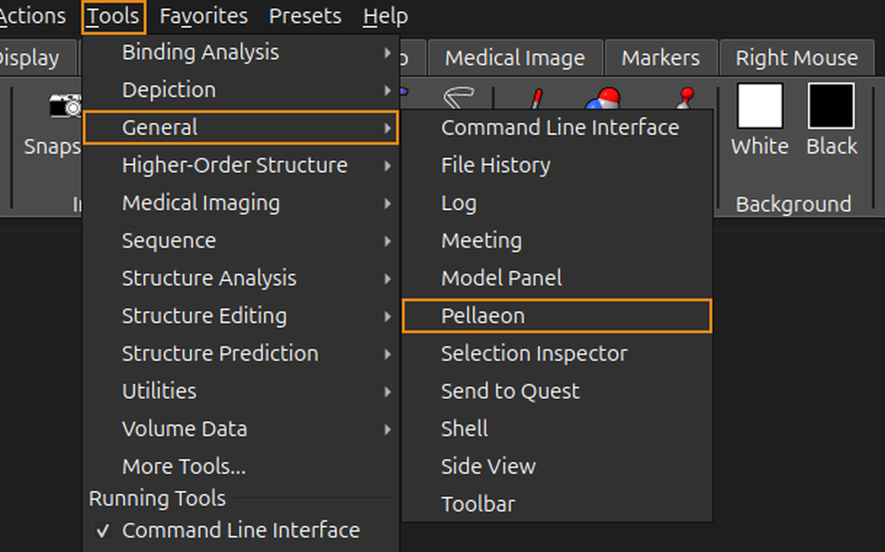

Or type `ui tool show Pellaeon` in the command line. Nothing else to install: no Python, no terminal, no admin rights. (Offline? See [Installation](install.md).)

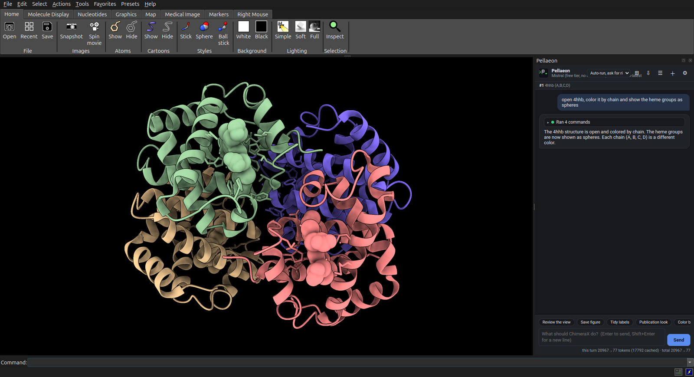

### 2. Connect an AI (once)

The panel opens on its settings page. You have two easy choices:

- **Nothing to install (recommended to start):** pick **Google Gemini**, click "get a key", sign in with a Google account at AI Studio, press *Create API key*, paste it into Pellaeon. Free, no credit card, takes two minutes.
- **Everything stays on your computer:** pick **Ollama**. Pellaeon checks whether Ollama is installed; if not, it offers the download link (ollama.com, a normal installer). After installing, press **Pull** next to `qwen3:8b` once (5 GB, needs a gaming-class GPU; on a laptop pull `qwen3:4b` instead and expect slower answers).

Press **Test connection**, then **Save & use**, or **Run a first request**, which saves the settings and has the AI open ubiquitin and color it by chain. You can switch providers any time with the gear icon.

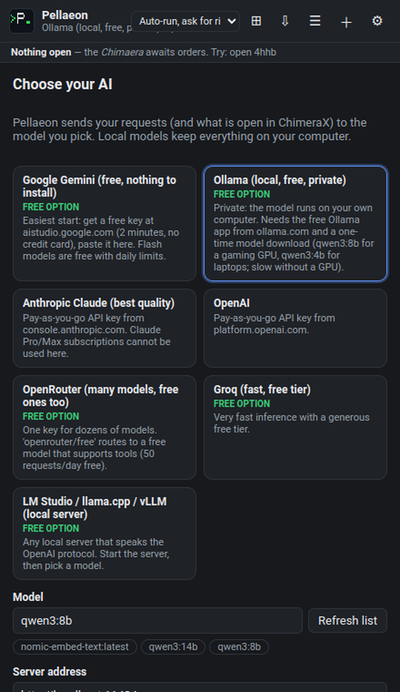

## Part 2 — Step by step

Type each request into the box at the bottom and press Enter. Typos and casual phrasing are fine.

### Step 1 · Open a structure

> open 4hhb

Pellaeon fetches human hemoglobin from the PDB and tells you what it found: four chains (two alpha, two beta), heme groups and a phosphate.

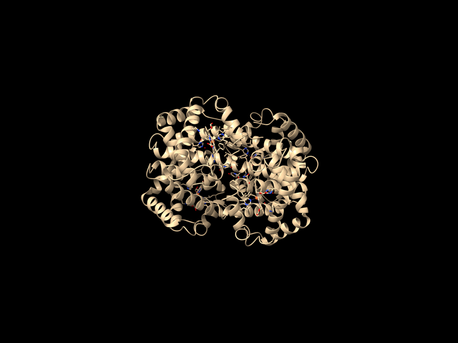

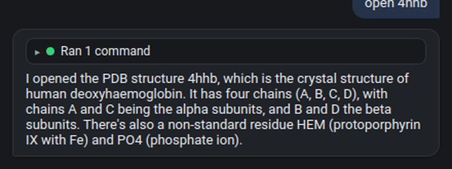

The **Ran 1 command** line is the exact ChimeraX command it used. Click it to expand; every command has *copy*, *rerun* and *?* (opens ChimeraX's own documentation for that command).

### Step 2 · Color and style

> color it by chain and show the heme groups as spheres

"it" means the model you just opened. The chains get different colors and the four hemes appear as spheres.

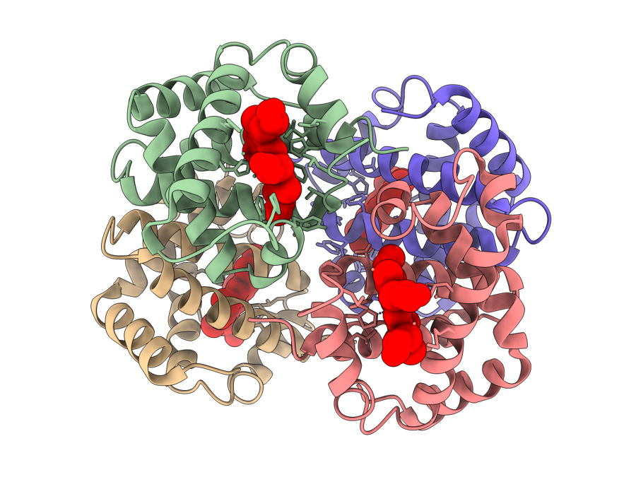

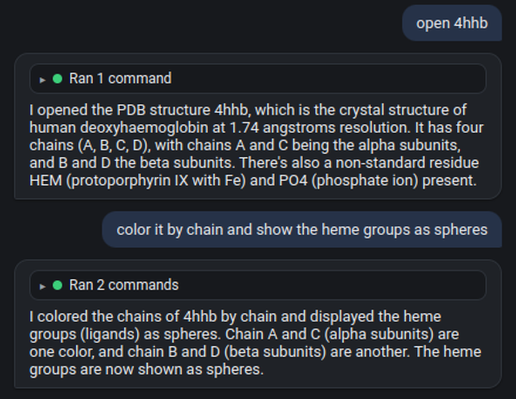

### Step 2b · Make it move

> make it spin

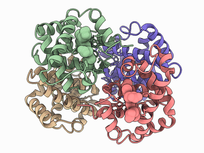

"stop it" stops. "slower", "spin the other way", "rock it back and forth" all work. Continuous motion is also the easiest way to check a figure from every side before you save it.

### Step 3 · Click on something and ask about it

Ctrl-click any atom in the 3D view (that is ChimeraX's normal way of selecting). A bar appears above the input. **Highlight** colors the selection and shows its atoms; the two questions send it to the AI. Alt-click asks about a residue directly, without selecting first (the `pellaeon ask` mouse mode; rebind it with `ui mousemode alt leftMode "pellaeon ask"` if you use Alt for something else).

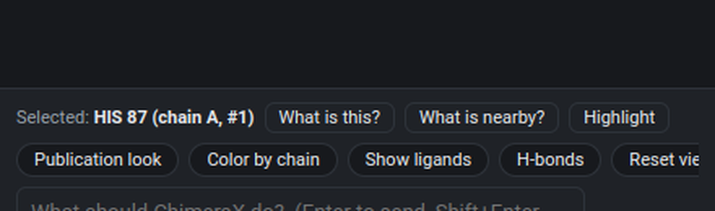

Press **What is nearby?** (or type your own question). **Why this color?** answers from Pellaeon's own record of what colored the residue (step 3b). Pellaeon looks up the residues and ligands within 5 Å, shows them as sticks and labels them:

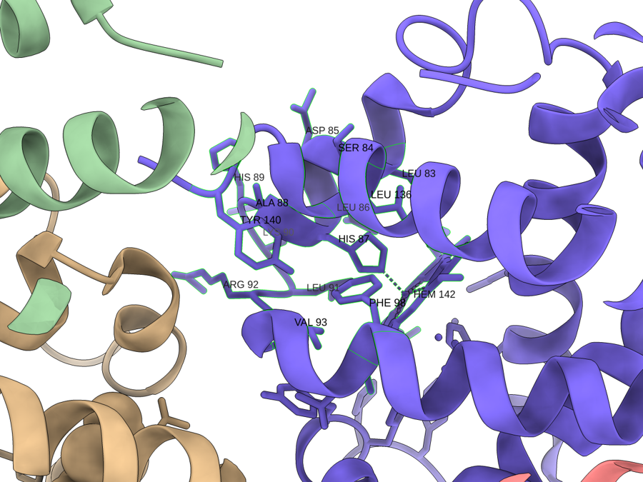

His 87 of chain A is the proximal histidine that holds the heme iron; the sticks around it are the heme and its pocket.

### Step 3b · Why is this residue this color?

Select a residue and press **Why this color?**, or type it. Pellaeon does not guess a biological reason: it reports the residue's current colors and labels, the recorded command, annotation, table or comparison that produced them, and any value behind them.

> Why is residue 87 (HIS) of chain A in 4hhb this color?

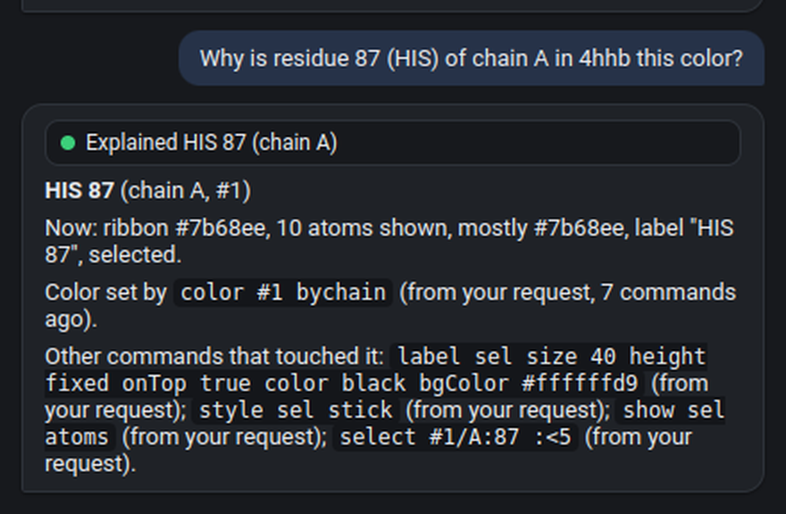

Related: a command that runs without error but matches nothing (wrong residue numbers, wrong chain) is marked *changed nothing* with an amber dot, and the model is told to fix it, instead of getting a green tick.

### Step 4 · Make it look like a figure

> make it look publication ready and focus on the heme of chain A

This applies ChimeraX's publication preset and centres the view on the heme of chain A:

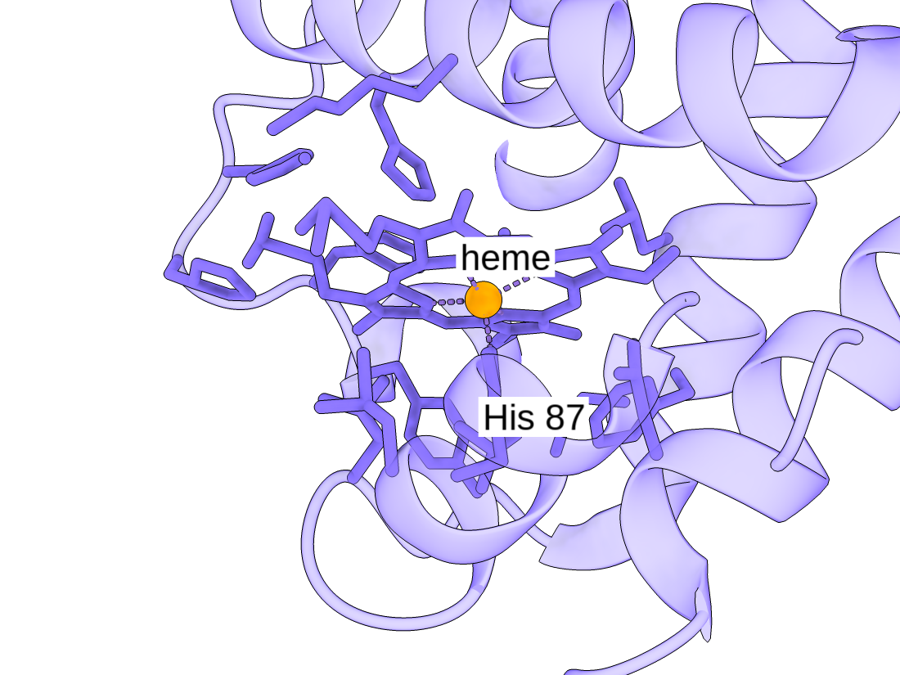

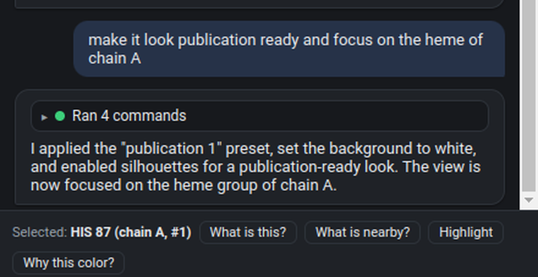

To save it: "save a picture to my desktop". Saving writes a file, so Pellaeon shows a confirmation card first (Step 10).

### Step 5 · Measure something

> measure the distance between the iron of the heme in chain A and the CA of residue 87 in chain A

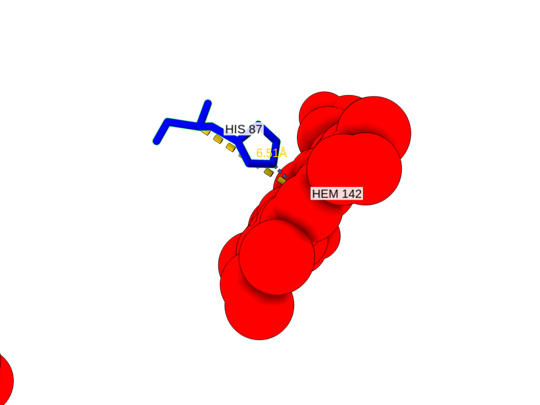

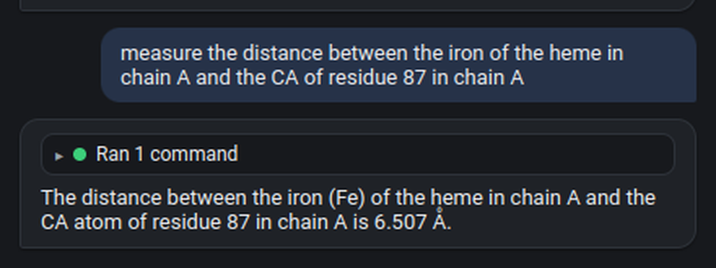

The number is shown in the 3D view and in the reply. Angles, hydrogen bonds ("show hydrogen bonds"), clashes and contacts work the same way.

### Step 6 · Open an AlphaFold model by gene name

> close everything, then open the AlphaFold model of the gene F2RL1

Pellaeon looks the gene up in UniProt (F2RL1 is PAR2, accession P55085) and opens the AlphaFold model. AlphaFold models are colored by confidence: blue is confident, orange is not.


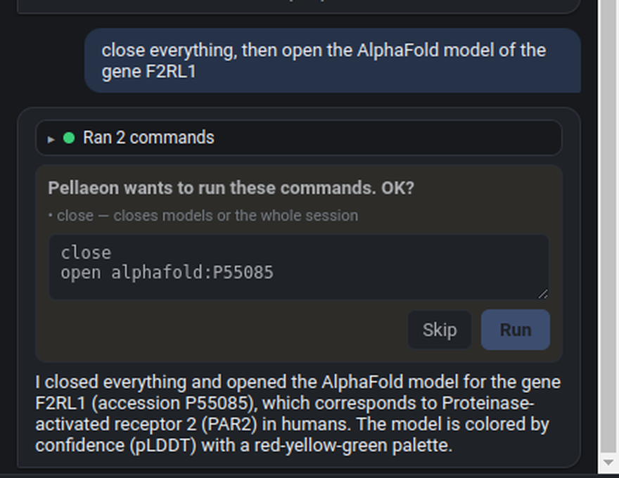

"close everything" asked for confirmation first: closing models is one of the risky actions.

### Step 7 · Paint annotations from UniProt

> color the transmembrane helices orange and the rest white

Pellaeon fetches the transmembrane segments from UniProt and colors exactly those residues. The seven helices of this receptor light up:

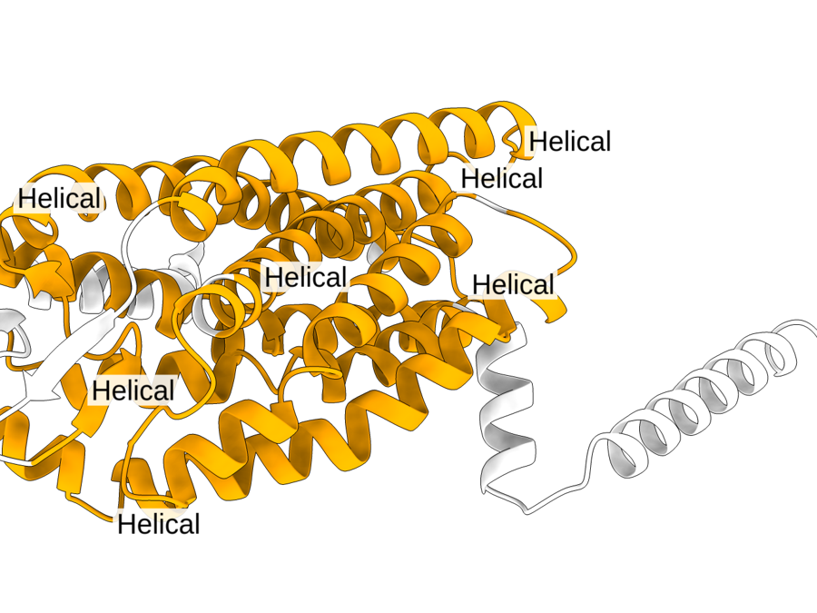

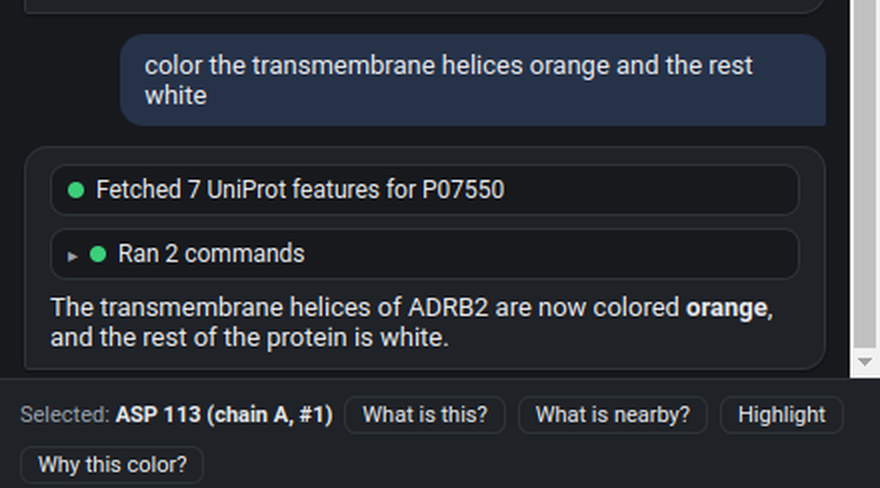

The same works for domains, binding sites, active sites, glycosylation, disulfides.

### Step 8 · Disease variants from ClinVar

> close everything and open the AlphaFold model of the gene HBB

> show the ClinVar disease variants of HBB on it

Hemoglobin beta again, this time the AlphaFold model, with every ClinVar missense position colored by clinical significance (red pathogenic, yellow uncertain, blue benign) and the pathogenic ones labeled, sickle-cell E7V among them.

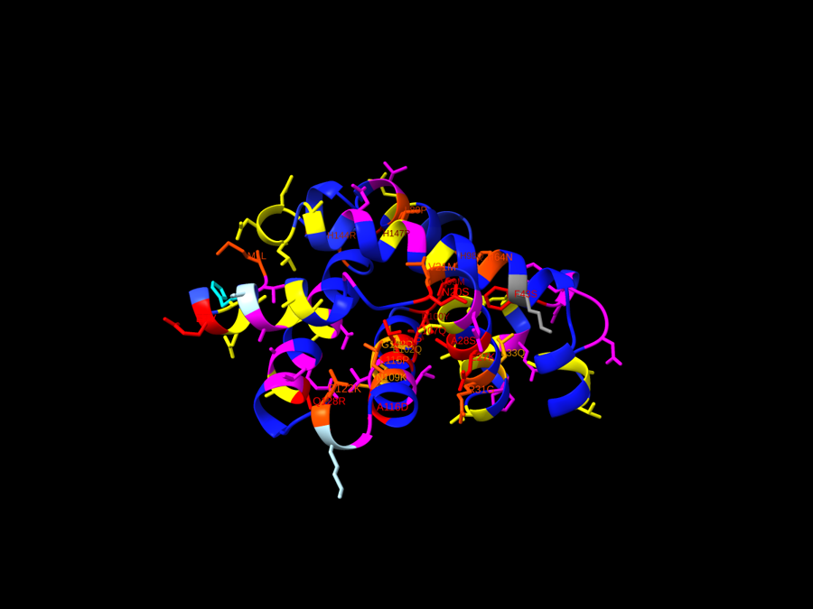

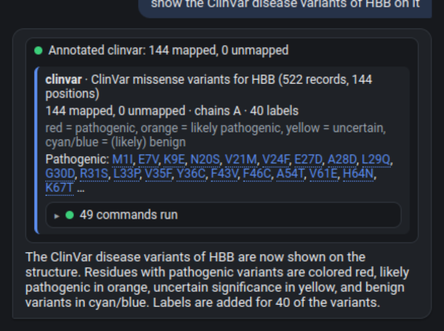

Pellaeon maps UniProt numbering onto the model's chains (PDB entries often start counting differently) and checks that the residue in the model really is the reference amino acid; mismatches are skipped and counted in the card.

### Step 8b · When labels pile up

Twenty-five variant labels on a small protein overlap. Say so:

> the labels overlap, tidy them

Pellaeon works out where every label sits on screen, moves the colliding ones to a free spot next to their residue and removes the ones that cannot fit, then tells you which. Ask for specific residues to label those again.

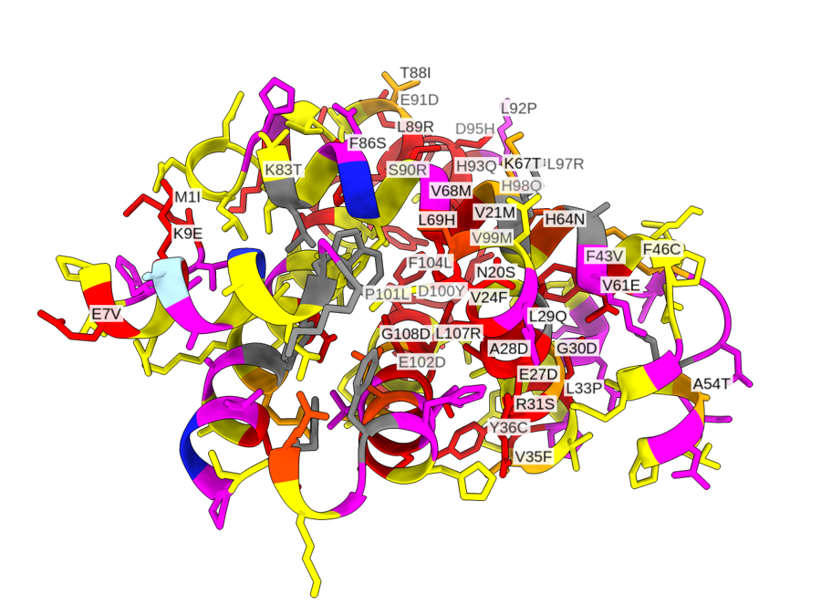

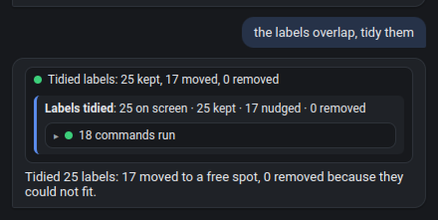

### Step 9 · Compare two conformations

Open two structures of the same enzyme (adenylate kinase, open and closed):

> close everything, open 4ake and 1ake, then compare these two models and tell me what changed

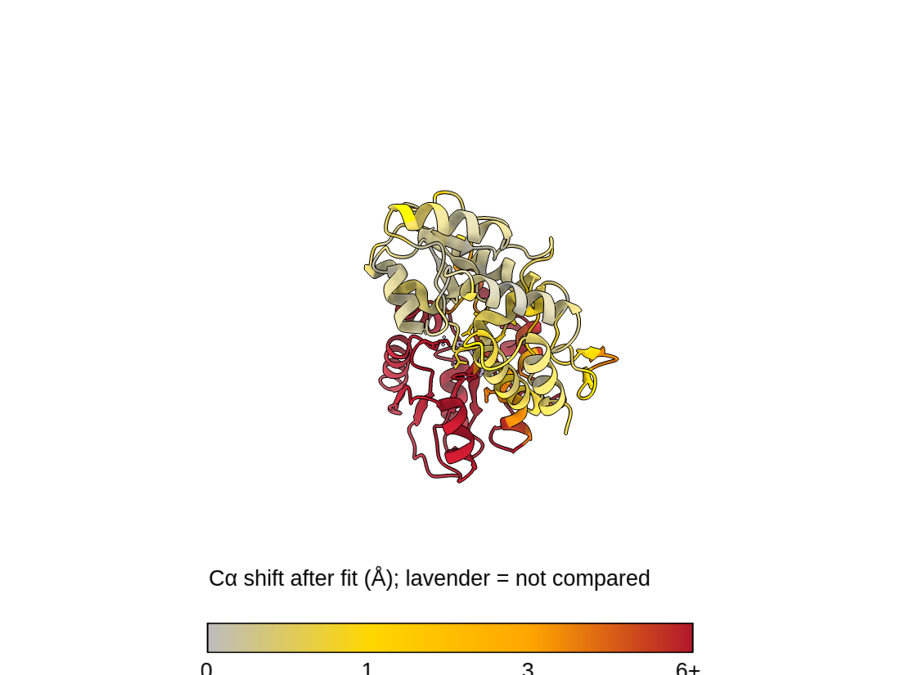

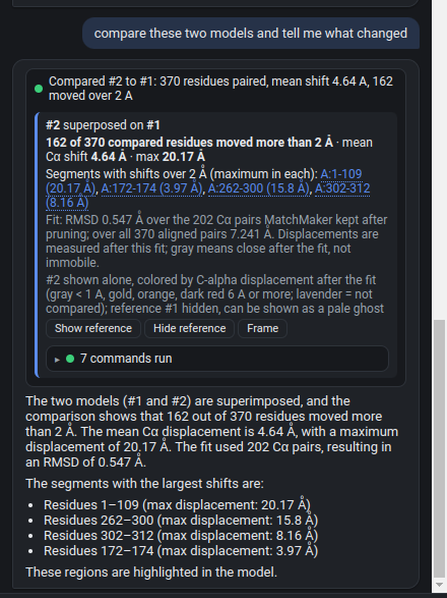

The second model is superposed on the first and colored by how far each residue moved (gray unchanged, red 6 Å or more). The card lists the moving regions; clicking one recentres the view on it. Here the LID domain (residues 117–167) swings 25 Å.

### Step 10 · Risky commands ask first

> close everything

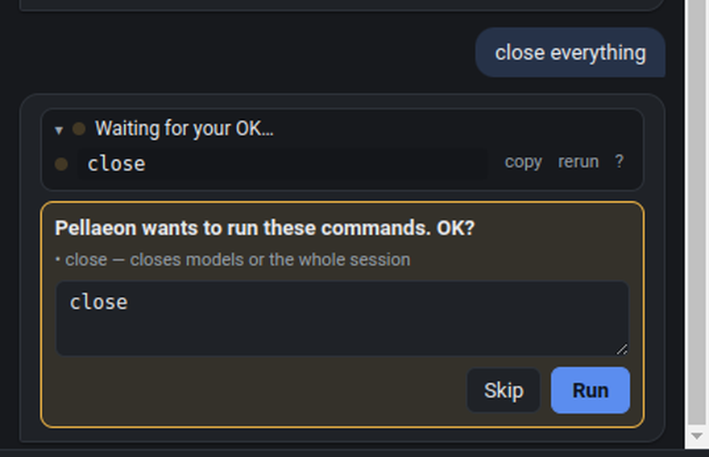

Closing, deleting, saving files and running scripts always show this card with the exact commands, editable. **Run** or **Skip**. The dropdown at the top switches between *ask before every command*, *auto-run but ask for risky ones* (default) and *never ask*.

### Step 11 · Your own data on the structure

Any per-residue table can be painted onto a structure: conservation scores, deep mutational scanning, contact changes, your own residue groups. The table needs a residue-position column; a chain column, a reference-residue column (wild-type amino acid) and an accession column are used when present.

1. Open a structure (`open 1ubq`), then press the **Import table** button (⊞) in the panel header and pick a CSV or TSV. [ubiquitin_hydropathy.csv](examples/ubiquitin_hydropathy.csv) is a small example: Kyte-Doolittle hydropathy for every residue of ubiquitin.
2. A card shows what Pellaeon detected: the position column, the reference-residue column, the chain column, and a few sample rows. Choose the column to color by, the model, the palette and whether the table uses the structure's residue numbers or UniProt numbering, then press **Apply**.

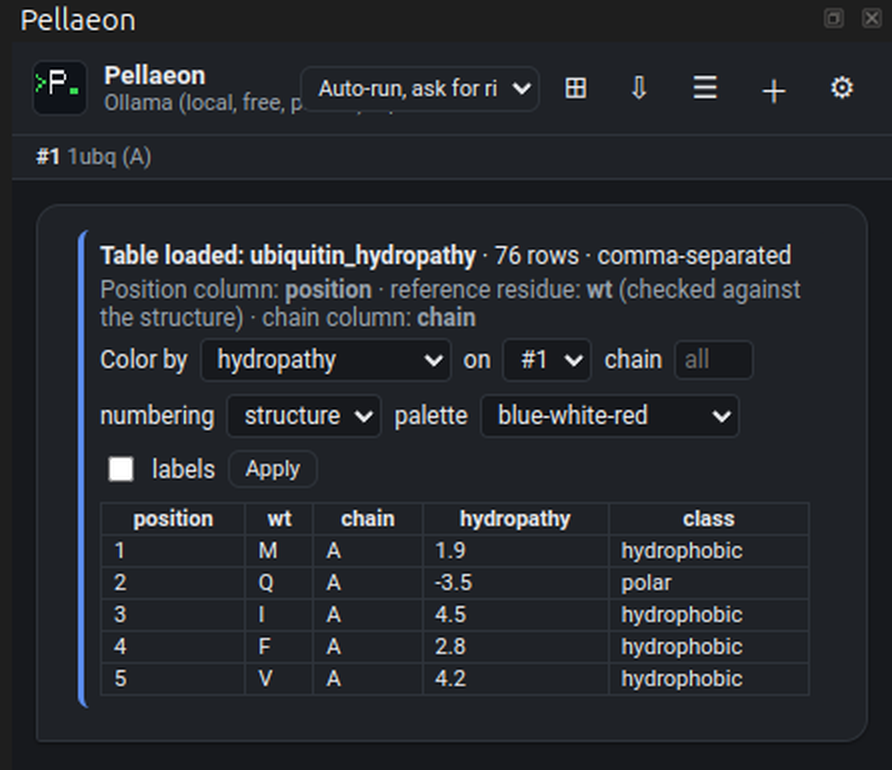

3. The result card says how many rows were placed, which positions do not exist in the structure, and how many rows were **skipped because the reference residue did not match** the structure. A wrong numbering shows up here as a wall of mismatches instead of a silently wrong picture. Numeric columns get a color ramp (residues without a value stay gray), text columns get one color per category.
4. The AI now knows about the table, so you can ask in words. Applied tables appear as **Layers** chips above the composer; click one to re-apply it after other coloring.

> label the residues with hydropathy above 3 and show them as sticks

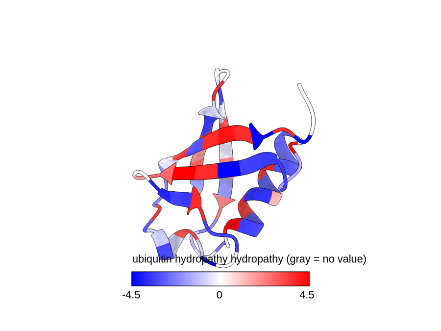

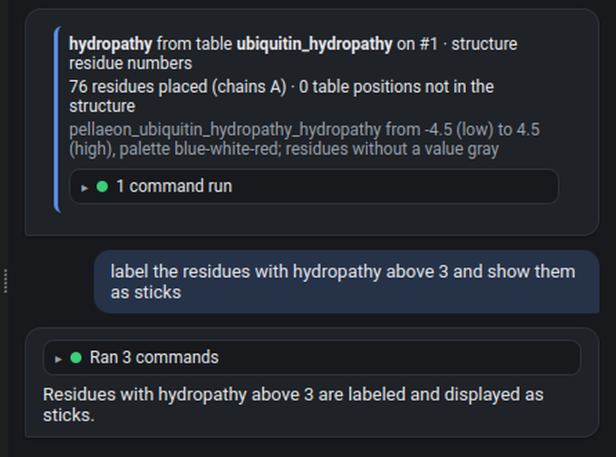

The color ramp comes from `color byattribute`: every value is stored as a residue attribute (`pellaeon_<table>_<column>`), so ChimeraX's own `key` command, attribute selection (`select ::pellaeon_ubiquitin_hydropathy_hydropathy>3`) and saved sessions all work with it. Table overlays are ChimeraX-edition only.

## Part 3 — Good to know

- **Green means it happened:** a command that ran but matched nothing shows an amber *changed nothing* mark, and "why is this red?" tells you which command, table or annotation gave a residue its look.
- **Labels** are drawn at a fixed size, on top of everything, with a white background, so they stay readable in screenshots; when more than twenty residues are labeled at once, one-letter codes (H87) are used. Ask for a specific size or color and Pellaeon uses that instead; the switch is in Settings ▸ Advanced.
- **Undo:** "undo the last change" (ChimeraX undoes most commands; closing a model cannot be undone).
- **When it gets a command wrong**, it reads ChimeraX's error and the real syntax and retries once or twice. Say "you did not" or "that didn't work" and it will not repeat the same thing.
- **Export a session as a script:** the ⇩ button saves every command that actually ran as a `.cxc` file; replay it with `open myscript.cxc`.
- **Your own data:** ⊞ imports a per-residue CSV/TSV (Step 11).
- **Past chats:** ☰ lists them; + starts a new one.
- **From ChimeraX's own command line:** `pellaeon color everything by chain`.
- **Classic Chimera 1.x:** there is a separate edition, same panel in your browser. See [Classic edition](classic.html).

## Troubleshooting

| Symptom | Fix |
|---|---|
| "Ollama is not running" | Start Ollama (Windows: it is in the system tray; or run `ollama serve`), or switch to the Gemini card. |
| "model not found" | Settings ▸ **Pull** the model, or type its exact name (`ollama list` shows what you have). |
| Empty or very slow answers with Ollama | Use `qwen3:8b` on a GPU; on CPU-only PCs use `qwen3:4b` and expect 10–30 s per request. |
| "rejected the API key (401)" | Re-paste the key; check it belongs to the provider you selected. |
| Panel is blank | `Tools ▸ General ▸ Pellaeon` again, or restart ChimeraX. |
| Something changed that you did not want | "undo", or reopen the structure. |

Named after Gilad Pellaeon, captain of the *Chimaera*. Yes, sir.
