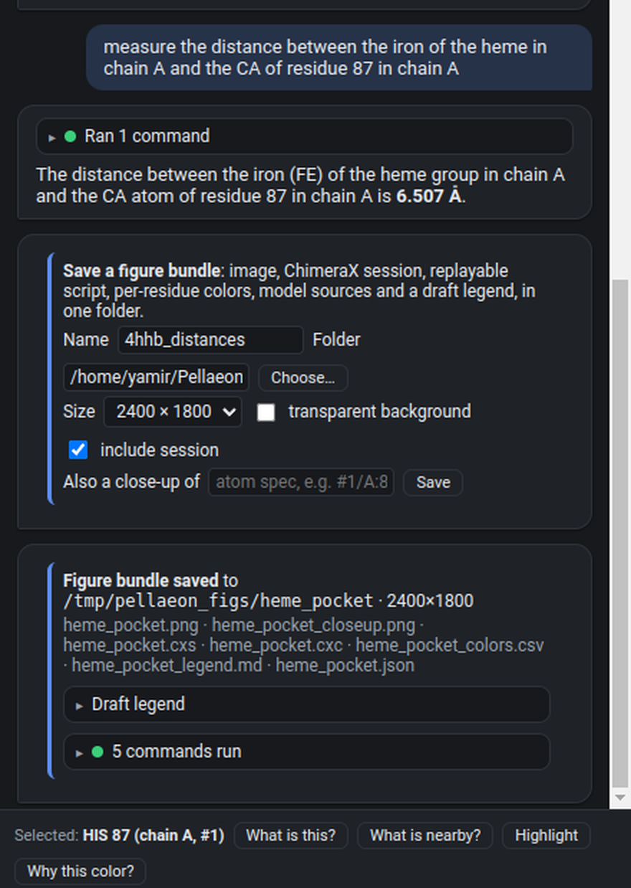
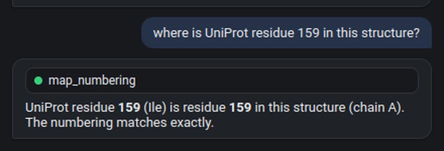
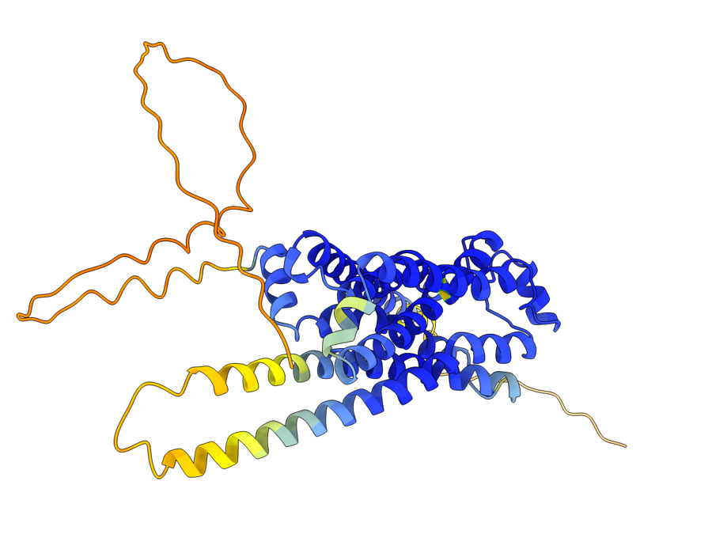
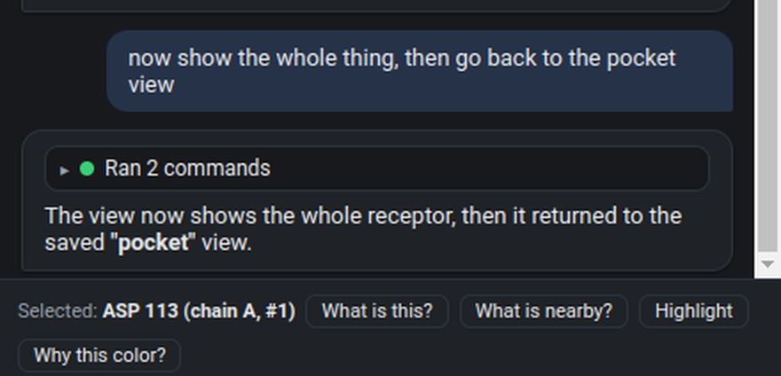
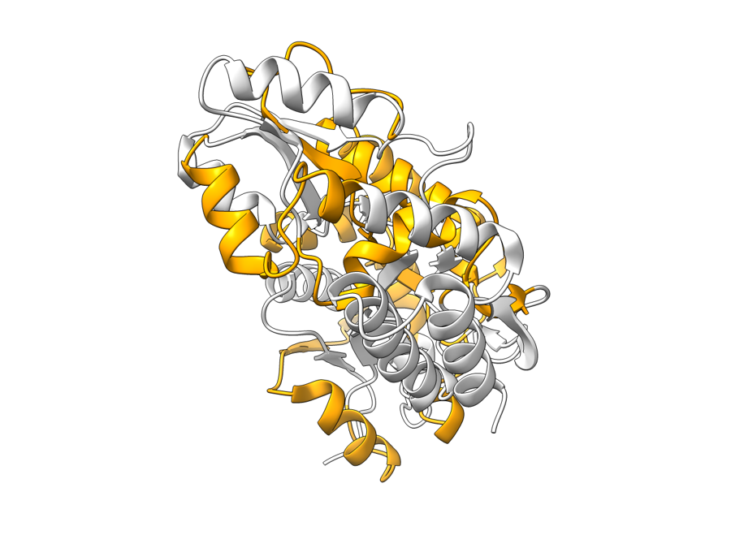
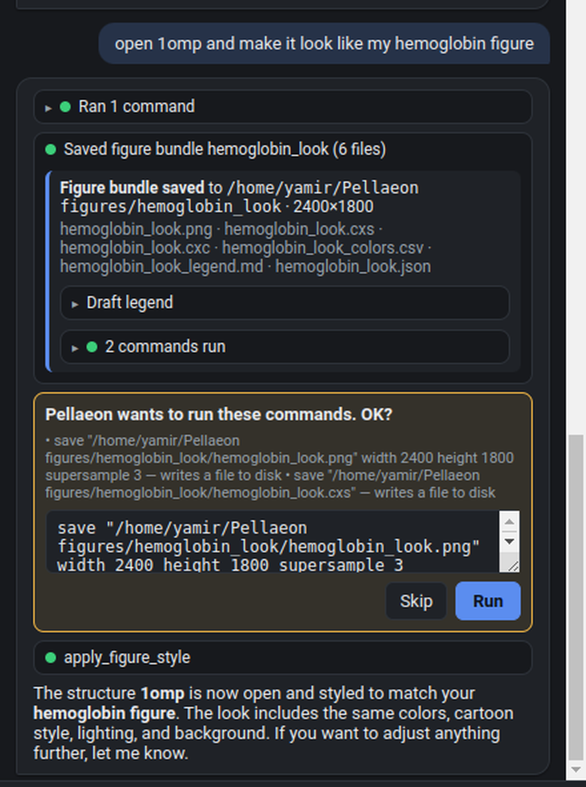
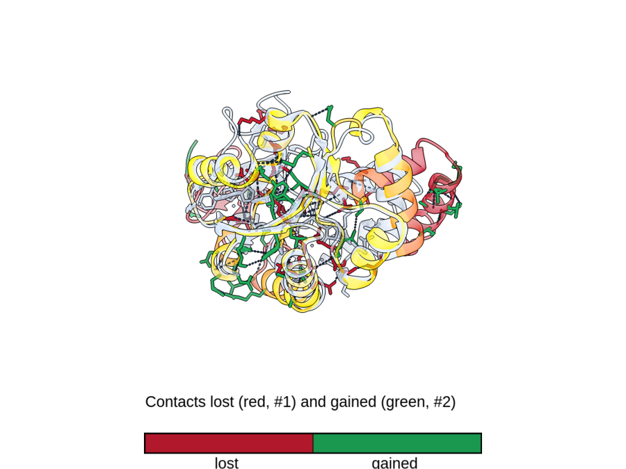
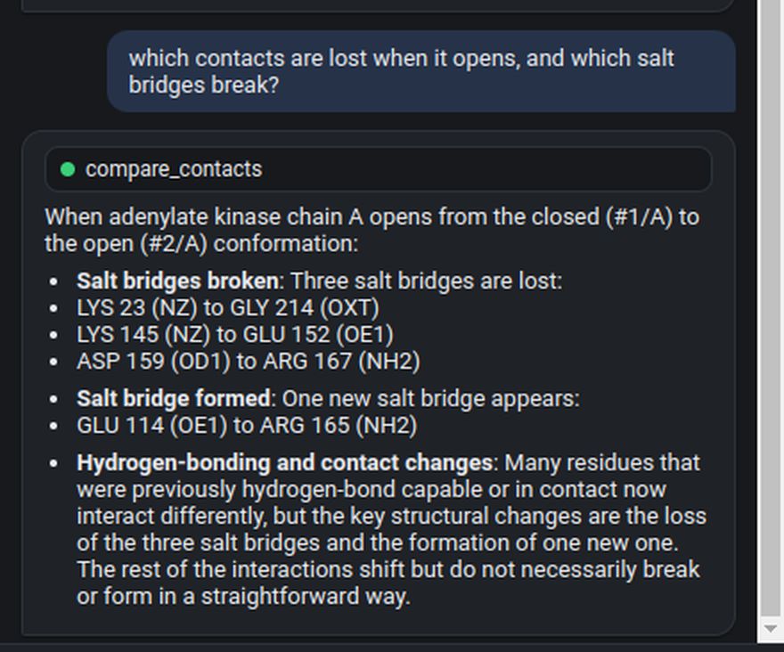

# Pellaeon tutorial

The full walkthrough takes about twenty minutes: hemoglobin, a residue and its neighbours, a figure, a distance, an AlphaFold model by gene name, variants, two conformations of an enzyme, and your own data. Each step shows what to type, what Pellaeon ran, and what ChimeraX shows afterwards.

## Five-minute version

1. In ChimeraX's **Command:** line, paste `open https://github.com/tggr-lab/pellaeon/releases/latest/download/install_pellaeon.py` and press Enter.
2. The panel opens on its settings page. Pick **Mistral** (free key, nothing to install) or **Ollama** (runs on your computer), press **Test connection**, then **Save & use**.
3. Press **Run a first request**. Pellaeon opens ubiquitin and colors it by chain.
4. Type these into Pellaeon's message box, one at a time:

    - `close everything and open 4hhb`
    - `color it by chain and show the heme groups as spheres`
    - `make it look publication ready`

The rest of this page is the full walkthrough.

## Part 1: Setup

### 1. Install ChimeraX and Pellaeon

1. Install [UCSF ChimeraX](https://www.cgl.ucsf.edu/chimerax/download.html) 1.9 or newer (Windows: run the installer with the defaults).
2. Start ChimeraX. Click into the **Command:** line at the bottom of the window, paste this and press Enter:

```
open https://github.com/tggr-lab/pellaeon/releases/latest/download/install_pellaeon.py
```

The Pellaeon panel appears on the right. If you close it, or the next time you start ChimeraX, open it from the menu: **Tools ▸ General ▸ Pellaeon**.


Or type `ui tool show Pellaeon` in the command line. Nothing else to install: no Python, no terminal, no admin rights. (For an offline install, see [Installation](install.md).)


### 2. Connect an AI (once)

The panel opens on its settings page. You have two easy choices:

- **Nothing to install (recommended to start):** pick **Mistral**, click "get a key", sign up at console.mistral.ai, press *Create new key*, and paste it into Pellaeon. Free, no credit card, takes two minutes. Pellaeon uses `ministral-8b-latest`, which the free tier serves at about 190 requests a minute, so you will not sit waiting on a quota. Google Gemini is an equally good choice at a slower 15 requests a minute; its key comes from AI Studio the same way.
- **The AI runs on your computer:** pick **Ollama**. (Structures and annotations are still fetched from the PDB, UniProt and ClinVar when you ask for them.) Pellaeon checks whether Ollama is installed; if not, it offers the download link (ollama.com, a normal installer). After installing, press **Pull** next to `qwen3:8b` once (5 GB, needs a gaming-class GPU; on a laptop pull `qwen3:4b` instead and expect slower answers).

One thing to know before you paste a cloud key: the free tiers of Mistral and Gemini are evaluation tiers, and both providers may use what you send to improve their models. What gets sent is your request, the list of open models and the current selection. For unpublished structures, use Ollama, where nothing leaves your computer, or a paid tier.

Press **Test connection**, then **Save & use**, or **Run a first request**, which saves the settings and has the AI open ubiquitin and color it by chain. You can switch providers any time with the gear icon.


## Part 2: Step by step

Type each request into the box at the bottom and press Enter. Typos and casual phrasing are fine. The pictures on this page were rendered on a white background with silhouettes (`set bgColor white; lighting soft; graphics silhouettes true`); yours will be on black until step 4, which is fine.

### Step 1 · Open a structure

> open 4hhb

Pellaeon fetches human hemoglobin from the PDB and tells you what it found: four chains (two alpha, two beta), heme groups and a phosphate.


The **Ran 1 command** line is the exact ChimeraX command it used. Click it to expand; every command has *copy*, *rerun* and *?* (opens ChimeraX's own documentation for that command).

### Step 2 · Color and style

> color it by chain and show the heme groups as spheres

"it" means the model you just opened. The chains get different colors and the four hemes appear as spheres.


### Step 2b · Make it move

> make it spin


"stop it" stops. "slower", "spin the other way", "rock it back and forth" all work. Continuous motion is also the easiest way to check a figure from every side before you save it.

### Step 3 · Click on something and ask about it

Ctrl-click any atom in the 3D view (that is ChimeraX's normal way of selecting); to get exactly this example, type `select #1/A:87` in ChimeraX's command line (`#1` is hemoglobin, the first model). A bar appears above the input. **Highlight** colors the selection and shows its atoms; the two questions send it to the AI. Alt-click asks about a residue directly, without selecting first (the `pellaeon ask` mouse mode; rebind it with `ui mousemode alt leftMode "pellaeon ask"` if you use Alt for something else).


Press **What is nearby?** (or type your own question). **Why this color?** answers from Pellaeon's own record of what colored the residue (step 3b). Pellaeon looks up the residues and ligands within 5 Å, shows them as sticks and labels them:


His 87 of chain A is the proximal histidine that holds the heme iron; the sticks around it are the heme and its pocket.

### Step 3b · Why is this residue this color?

Select a residue and press **Why this color?**, or type it. Pellaeon does not guess a biological reason: it reports the residue's current colors and labels, the recorded command, annotation, table or comparison that produced them, and any value behind them.

> Why is residue 87 (HIS) of chain A in 4hhb this color?


A command that runs without error but matches nothing (wrong residue numbers, wrong chain) is marked *changed nothing* with an amber dot, and the model is told to fix it, instead of getting a green tick.

### Step 4 · Make it look like a figure

> make it look publication ready and focus on the heme of chain A

This applies ChimeraX's publication preset and centres the view on the heme of chain A:


To save it: "save a picture to my desktop". Saving writes a file, so Pellaeon shows a confirmation card first (Step 10).

### Step 5 · Measure something

> measure the distance between the iron of the heme in chain A and the CA of residue 87 in chain A


CA is the Cα backbone atom, so this is the iron to backbone distance, about 6.5 Å, not the Fe–His coordination bond (that would be the NE2 atom of His 87, about 2.1 Å). The number is shown in the 3D view and in the reply. Angles, hydrogen bonds ("show hydrogen bonds"), clashes and contacts work the same way.

### Step 5b · Save a figure you can reproduce

Do this now, while hemoglobin is still open. Press **Save figure** above the composer (or say "save this as a figure called heme_pocket"). Pick a name and a folder, a size, optionally a close-up (an atom spec such as `#1/A:87 :<6`, the residues within 6 Å of His 87), and press **Save**.



The folder contains more than the picture:

| File | What it is |
|---|---|
| `heme_pocket.png`, `heme_pocket_closeup.png` | the image, plus the close-up if you asked for one |
| `heme_pocket.cxs` | a ChimeraX session (when *include session* is ticked): reopen and keep working |
| `heme_pocket.cxc` | the commands Pellaeon recorded, replayable with `open heme_pocket.cxc`; mouse rotations and commands typed outside Pellaeon are not in it, the session is |
| `heme_pocket_colors.csv` | ribbon and atom color of every residue |
| `heme_pocket_legend.md` | a draft legend written only from the recorded commands, annotations and tables |
| `heme_pocket.json` | structures and their sources (PDB id, AlphaFold accession or file), camera, background, sizes |

When the AI saves a figure on its own the image save asks for your OK first, like any other file write.

### Step 6 · Open an AlphaFold model by gene name

> close everything, then open the AlphaFold model of the gene ADRB2

Pellaeon looks the gene up in UniProt (ADRB2 is the beta-2 adrenergic receptor, accession P07550) and opens the AlphaFold model. AlphaFold models are colored by confidence (pLDDT): dark blue very confident, light blue confident, yellow low, orange very low. Confidence in the prediction of that stretch, not experimental evidence and not motion.


"close everything" asked for confirmation first: closing models is one of the risky actions.

### Step 6b · Numbering from a paper

> where is UniProt residue 159 in this structure?

The AlphaFold model uses UniProt numbering, so here it is residue 159 exactly. Try the same on an experimental structure and the answer is often different: a missing initiator methionine, an expression tag or a construct that starts at residue 20 shifts every number. Pellaeon maps the positions through the chain's own UniProt alignment and reports the offset, or that it varies along the chain, before anything gets colored. Ask "color UniProt positions 120 to 135 orange" and it maps them first.



### Step 6c · Bookmark a view

> zoom in on residue 159 and bookmark this view as pocket

> now show the whole thing, then go back to the pocket view

Bookmarks are ChimeraX's named views: Pellaeon lists the ones you have saved in what it tells the model, so "back to the pocket view" works, and "make a movie touring my bookmarks" produces a fly-through (the encode step asks for your OK, like any file save).





### Step 7 · Paint annotations from UniProt

> color the transmembrane helices orange and the rest white

Pellaeon fetches the transmembrane segments from UniProt and colors exactly those residues. The seven helices of this receptor light up:


The same works for domains, binding sites, active sites, glycosylation, disulfides.

### Step 8 · Disease variants from ClinVar

> close everything and open the AlphaFold model of the gene HBB

> show the ClinVar disease variants of HBB on it

Hemoglobin beta again, this time the AlphaFold model, with the ClinVar missense positions that mapped onto the model colored by clinical significance: red pathogenic, orange likely pathogenic, magenta conflicting, yellow uncertain, cyan and blue (likely) benign. When several variants sit on one position the most severe class wins. The pathogenic ones are labeled; E7V is the sickle-cell mutation (ClinVar counts the initiator methionine, so it is Glu6→Val in mature-chain numbering). This is the AlphaFold model of one β chain, not the tetramer from step 1.


Pellaeon maps UniProt numbering onto the model's chains (PDB entries often start counting differently) and checks that the residue in the model really is the reference amino acid; mismatches are skipped and counted in the card.

### Step 7b · Re-use a look

Once you have saved a figure bundle (step 5b), its styling can be applied to something else:

> open 1omp and make it look like my hemoglobin figure

Pellaeon replays the bundle's styling commands, colors, cartoon and surface style, lighting and background, on the new structure and leaves out the bundle's own open, save and close steps. That is how a lab keeps one look across a paper.





### Step 8b · When labels pile up

Twenty-five variant labels on a small protein overlap. Say so:

> the labels overlap, tidy them

Pellaeon works out where every label sits on screen, moves the colliding ones to a free spot next to their residue and removes the ones that cannot fit, then tells you which. It is a fix for the current view: rotate or resize and ask again. Ask for specific residues to label those again.


### Step 9 · Compare two conformations

Maltose-binding protein is a classic hinge: open without ligand (1omp), closed around maltose (1anf). Open both, then ask:

> close everything, open 1omp and 1anf, then compare these two models and tell me what changed


What you are looking at: the second model (closed, 1anf) after superposition on the first, shown alone and colored by how far each Cα moved between the two forms: gray under 1 Å, gold, orange, dark red 6 Å or more; a key sits in the corner. The reference is hidden; **Show reference** on the card draws it as a pale ghost on top. Gray means the residue sits close to its counterpart *after the fit*; it is not a statement about which part is the hinge.


The card leads with the change: how many residues moved more than 2 Å, the mean and maximum shift, and the segments with the largest shifts (each clickable). Below it, the fit details: MatchMaker's RMSD over the Cα pairs it kept after pruning, and the RMSD over all aligned pairs. They are different numbers about different sets of atoms, which is why the card keeps them apart.

### Step 9b · Which contacts change

> which contacts are lost when it opens, and which salt bridges break?

Where step 9 asks how far residues moved, this asks what they stopped touching. Pellaeon collects every residue-residue contact in both conformations, matches them through the same alignment, and draws the lost ones as red dashes on the closed form and the gained ones green on the open form, with a key. The reply leads with one sentence a biologist would write: how many contacts were lost and gained, which salt bridges broke, and where the change clusters. Add "for the ligand" to see only what the ligand touches in one form but not the other.





### Step 10 · Risky commands ask first

> close everything


Closing, deleting, saving files and running scripts always show this card with the exact commands, editable. **Run** or **Skip**. The dropdown at the top switches between *ask before every command*, *auto-run but ask for risky ones* (default) and *never ask*.

### Step 11 · Your own data on the structure

Any per-residue table can be painted onto a structure: conservation scores, deep mutational scanning, contact changes, your own residue groups. The table needs a residue-position column; a chain column, a reference-residue column (wild-type amino acid) and an accession column are used when present.

1. Open a structure (`open 1ubq`), then press the **Import table** button (⊞) in the panel header and pick a CSV or TSV. [ubiquitin_hydropathy.csv](examples/ubiquitin_hydropathy.csv) is a small example: Kyte-Doolittle hydropathy for every residue of ubiquitin.
2. A card shows what Pellaeon detected: the position column, the reference-residue column, the chain column, and a few sample rows. For the example: column `hydropathy`, model `#1`, chain left empty, numbering `structure`, palette `blue-white-red`, then **Apply**. Expect 76 residues placed and no reference mismatches. Positive Kyte-Doolittle values are hydrophobic (red), negative hydrophilic (blue); a key appears in the 3D view.


3. The result card says how many rows were placed, which positions do not exist in the structure, and how many rows were **skipped because the reference residue did not match** the structure. A wrong numbering shows up here as a wall of mismatches instead of a silently wrong picture. Numeric columns get a color ramp (residues without a value stay gray), text columns get one color per category.
4. The AI now knows about the table, so you can ask in words. Applied tables appear as **Layers** chips above the composer; click one to re-apply it after other coloring.

> label the residues with hydropathy above 3 and show them as sticks


Every value is stored as a residue attribute named `pellaeon_<table>_<column>`, so ChimeraX's own attribute selection (`select ::pellaeon_ubiquitin_hydropathy_hydropathy>3`) and saved sessions work with it. Table overlays are ChimeraX-edition only.

## Part 3: Good to know

- **Review the view:** with a model that can see images (Gemini, Claude, OpenAI) and *Let the model look at screenshots* ticked in Settings ▸ Advanced, the **Review the view** chip makes Pellaeon take a screenshot, judge framing, clutter, labels and colors, fix what it can and look again. Local Ollama models cannot see the screen.
- **Green means it happened:** a command that ran but matched nothing shows an amber *changed nothing* mark, and "why is this red?" tells you which command, table or annotation gave a residue its look.
- **Labels** are drawn at a fixed size, on top of everything, with a white background, so they stay readable in screenshots; when more than twenty residues are labeled at once, one-letter codes (H87) are used. Ask for a specific size or color and Pellaeon uses that instead; the switch is in Settings ▸ Advanced.
- **Undo:** "undo the last change" runs ChimeraX's undo, which reverses supported actions only; one request can be several actions, and labels or closing a model cannot be undone. Save a session (`.cxs`) before experimenting on something you care about.
- **When it gets a command wrong**, it reads ChimeraX's error and the real syntax and retries once or twice. Say "you did not" or "that didn't work" and it will not repeat the same thing.
- **Export a session as a script:** the ⇩ button saves every command that actually ran as a `.cxc` file; replay it with `open myscript.cxc`.
- **Your own data:** ⊞ imports a per-residue CSV/TSV (Step 11).
- **Past chats:** ☰ lists them; + starts a new one.
- **From ChimeraX's own command line:** `pellaeon color everything by chain`.
- **Classic Chimera 1.x:** there is a separate edition, same panel in your browser. See [Classic edition](classic.html).

## Troubleshooting

| Symptom | Fix |
|---|---|
| "Ollama is not running" | Start Ollama (Windows: it is in the system tray; or run `ollama serve`), or switch to the Gemini card. |
| "model not found" | Settings ▸ **Pull** the model, or type its exact name (`ollama list` shows what you have). |
| Empty or very slow answers with Ollama | Use `qwen3:8b` on a GPU; on CPU-only PCs use `qwen3:4b` and expect 10–30 s per request. |
| "rejected the API key (401)" | Re-paste the key; check it belongs to the provider you selected. |
| Panel is blank | `Tools ▸ General ▸ Pellaeon` again, or restart ChimeraX. |
| Something changed that you did not want | "undo", or reopen the structure. |

Yes, sir.
